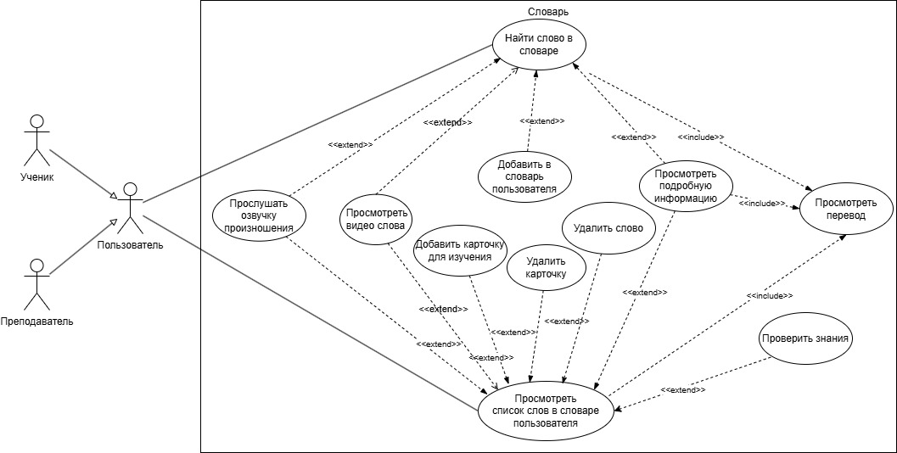

# Спецификация требований к веб-приложению Chatty для второго релиза

## Задача
Завершить спецификацию требований к ПО для второго релиза Chatty:

*   Дополнить спецификацию функциональными требованиями для функции карточек для запоминания новых слов.
*   Описать требования к новой функции просмотра видео. Для этого необходимо:
    *   обновить диаграмму UML Use Case;
    *   добавить новые табличные варианты использования;
    *   написать функциональные требования для функции видео.
*   Также для новой функции просмотра видео необходимо заполнить другие разделы спецификации:
    *   атрибуты качества;
    *   бизнес-правила;
    *   глоссарий.

## Процесс работы

## 1. Функциональные требования для карточек
На основе анализа вариантов использования разработаны функциональные требования для функции карточек.

### 1.1. Общее
*   **Словарь.Поиск:** Поиск слов в словаре
*   **Словарь.СловарьПользователя:** Работать со словарём пользователя

### 1.2. Функции карточек
*   **.ДобавитьКарточку:** Chatty должно предоставлять возможность добавления слова из словаря в карточку для изучения.
*   **.УдалитьКарточку:** Chatty должно предоставлять возможность удаления карточки из словаря пользователя.
*   **.ПроверитьПеревод:** Chatty должно предоставлять возможность проверить перевод слова из карточки.

## 2. Требования к видео

### 2.1. Обновленная Use Case Diagram UML
Далее была описана новая функция просмотра видео с примерами употребления изучаемых слов. Для этого:

*   Дополнила существующую Use Case диаграмму вариантами использования новой функции.
*   Провела анализ диаграммы и внесла необходимые дополнения.

Рис 2. Обновленная Use Case Diagram UML (видео)

Спецификация дополнена табличным описанием вариантов использования (ВИ-11, ВИ-12, ВИ-13, ВИ-14). Каждый вариант использования заполнен по полному шаблону Алистера Коберна.

### 2.2. Табличное описание вариантов использования

| Уникальный код и название | ВИ-11: Просмотреть видео                                                |
|---------------------------|----------------------------------------------------------------------------|
| Контекст использования     | Просмотр слова из словаря в видео формате                                 |
| Область действия           | Веб-приложение Chatty                                                      |
| Основное действующее лицо  | Преподаватель; Ученик                                                      |
| Предусловие                | Успешно выполнен базовый сценарий варианта использования “Просмотреть список слов в словаре пользователя” |
| Минимальные гарантии успеха| Видео недоступно                                                         |
| Гарантии успеха            | Видео просмотрено                                                        |
| Триггер                    | Пользователь хочет просмотреть контекст использования слова видео формате |
| Базовый сценарий           | Просмотр видео                                                           |
| 1                         | Пользователь выбирает нужное слово                                         |
| 2                         | Пользователь включает воспроизвести видео                                  |
| 3                         | Система отображает видео                                                    |
| 4                         | Пользователь просматривает видео                                           |
| Расширения                 | Видео недоступно                                                         |
| 3а                        | Система уведомляет об ошибке                                                |
| 3а1                       | Система предлагает пользователю сообщить об ошибке                         |
| 3а2                       | Возврат к шагу 1 основного сценария                                         |
| Изменения в технологии и данных | Использовать подключаемый словарь с возможностью просмотра слова в видео в контексте использования. |

| Уникальный код и название | ВИ-12: Управление субтитрами                                            |
|---------------------------|--------------------------------------------------------------------------|
| Контекст использования     | Просмотр видео с возможностью управления субтитрами                       |
| Область действия           | Веб-приложение Chatty                                                     |
| Основное действующее лицо  | Преподаватель; Ученик                                                     |
| Предусловие                | Успешно выполнен базовый сценарий варианта использования “Просмотреть видео” |
| Минимальные гарантии успеха| Субтитры не отображаются (сообщение об ошибке)                            |
| Гарантии успеха            | Видео просмотрено с субтитрами                                            |
| Триггер                    | Пользователь хочет управлять отображением субтитров во время просмотра видео |
| Базовый сценарий           | Управление субтитрами                                                     |
| 1                         | Пользователь включает субтитры на английском языке                        |
| 2                         | Система отображает субтитры на английском языке                            |
| 3                         | Пользователь включает перевод субтитров                                  |
| 4                         | Система отображает субтитры с переводом                                     |
| 5                         | Пользователь просматривает видео с субтитрами                              |
| Расширения                 | Субтитры недоступны                                                      |
| 4б1                       | Система уведомляет о временной ошибке, что не отображаются субтитры        |
| 4б2                       | Система предлагает пользователю сообщить об ошибке                        |
| Изменения в технологии и данных | Использовать распознавание видео дорожки в текст для отображения субтитров. |

| Уникальный код и название | ВИ-13: Переключение скорости видео                                     |
|---------------------------|--------------------------------------------------------------------------|
| Контекст использования     | Настройка скорости воспроизведения видео                                |
| Область действия           | Веб-приложение Chatty                                                    |
| Основное действующее лицо  | Преподаватель; Ученик                                                    |
| Предусловие                | Успешно выполнен базовый сценарий варианта использования “Просмотреть видео” |
| Минимальные гарантии успеха| Скорость не изменяется (сообщение об ошибке)                             |
| Гарантии успеха            | Видео просмотрено с заданной скоростью                                  |
| Триггер                    | Пользователь хочет изменить скорость просмотра видео                       |
| Базовый сценарий           | Переключение скорости видео                                                |
| 1                         | Пользователь изменяет скорость просмотра                                  |
| 2                         | Система отображает изменение скорости                                      |
| 3                         | Пользователь просматривает видео с новой скоростью.                    |
| Расширения                 | Переключение скорости видео недоступно                                   |
| 3а                        | Система уведомляет о временной ошибке, что отсутствует возможность изменить скорость просмотра |
| Изменения в технологии и данных | Использовать сторонние библиотеки для управления скоростью воспроизведения видео.   |

| Уникальный код и название | ВИ-14: Приостановка воспроизведения видео                                        |
|---------------------------|---------------------------------------------------------------------------------|
| Контекст использования     | Управление воспроизведением видео                                                |
| Область действия           | Веб-приложение Chatty                                                           |
| Основное действующее лицо  | Преподаватель; Ученик                                                           |
| Предусловие                | Успешно выполнен базовый сценарий варианта использования “Просмотреть видео”        |
| Минимальные гарантии успеха| Пауза не срабатывает (сообщение об ошибке)                                         |
| Гарантии успеха            | Видео поставлено на паузу и может быть возобновлено                                  |
| Триггер                    | Пользователь хочет приостановить воспроизведение видео                                |
| Базовый сценарий           | Приостановка воспроизведения видео                                                  |
| 1                         | Пользователь при просмотре видео ставит просмотр на паузу.                        |
| 2                         | Пользователь возобновляет воспроизведение видео                                   |
| Расширения                 | Приостановка воспроизведения видео недоступна                                       |
| 1а                        | Система уведомляет о временной ошибке, что отсутствует возможность поставить просмотр видео на паузу.  |
| Изменения в технологии и данных |  -                                                                                              |

### 2.3. Функции видео

*   **ПросмотретьВидео:** Chatty должно предоставлять возможность просмотра слова в видео формате из словаря в контексте использования носителями языка.
*   **ВидеоСубтитры:** Chatty должно предоставлять возможность при просмотре видео с помощью видеоплеера включать субтитры на английском, с возможностью включения перевода субтитров на родной язык пользователя.
*   **ВидеоСкорость:** Chatty должно предоставлять возможность при просмотре видео с помощью видеоплеера регулировать скорость просмотра.
*   **ВидеоПауза:** Chatty должно предоставлять возможность при просмотре видео с помощью видеоплеера поставить просмотр видео на паузу.

## 3. Атрибуты качества, бизнес-правила и глоссарий

### 3.1. Атрибуты качества

*   **Удобство использования**
    *   **УИ-4:** Видеоплеер должен быть интуитивно понятен и удобен для запуска одним нажатием.
*   **Производительность**
    *   **Про-4:** Веб-приложение должно запускать видео при просмотре слова из словаря пользователя не более чем через 5 секунд после того, как пользователь включает воспроизведение видео при скорости интернет-подключения 100 Мбит/сек.
    *   **Про-5:** Веб-приложение должно автоматически подбирать качество видео, основываясь на скорости интернет-подключения пользователя, с минимальным качеством 360p.

### 3.2. Бизнес-правила

| ID   | Определение правила                                     | Тип правила   | Статическое или динамическое | Источник          |
|------|----------------------------------------------------------|---------------|-----------------------------|-------------------|
| БП-3 | Видео в словаре пользователя должно быть отображено с указанием официального источника и автора |  Ограничение | Статическое               | Команда разработки ПО |

### 3.3. Глоссарий

| Термин                          | Определение                                                                        |
|-------------------------------|------------------------------------------------------------------------------------|
| Слово в видео формате          | Видео, показывающее использование слова из персонального словаря пользователя носителями языка. Видео демонстрирует контекст использования слова |
| Субтитры                      | Текстовая транскрипция видео                                                       |

## 4. Ссылки на документы

